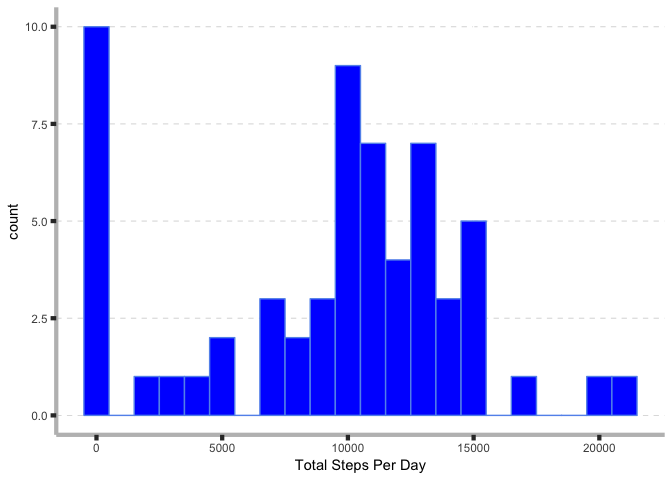
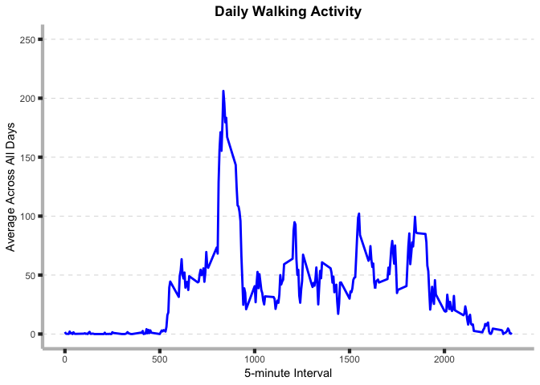
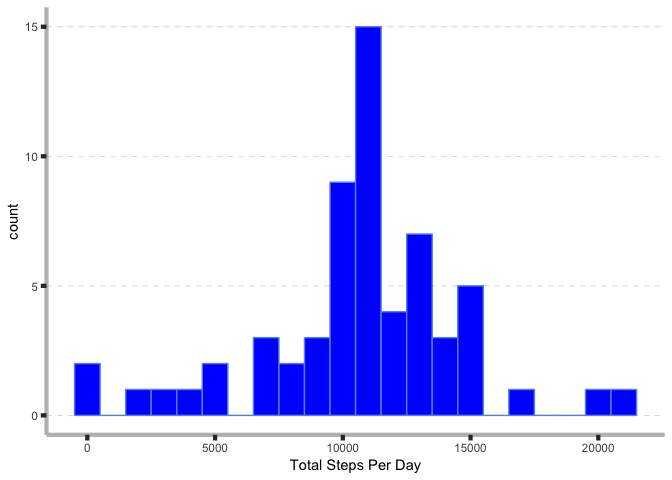
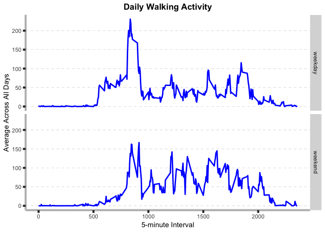

## Loading and preprocessing the data

```r
activity <- fread("activity.csv")
activity[, date := as.Date(date)]

plot_theme = theme(axis.line = element_line(color = "Gray", size = 1.5),
                    panel.grid.major.y = element_line(color = "Gray", size = 0.2, linetype = 2),
                    panel.background = element_rect(fill = 'white'),
                    axis.ticks = element_line(size = 1.5),        # Add axis ticks
                    axis.ticks.length = unit(0.15, 'cm'),
                    panel.spacing = unit(5, 'pt'),
                    plot.title = element_text(face = 'bold', hjust = 0.5))
```


## What is mean total number of steps taken per day?


```r
# Total number of steps taken each day
PerDay <- activity[, .(Total = sum(steps, na.rm = TRUE)), keyby = date]

# Histogram of the total number of steps taken each day
ggplot(PerDay, aes(x=Total)) +
  geom_histogram(colour="cornflowerblue", fill="blue", binwidth=1000) +
  labs(x = "Total Steps Per Day") +
  plot_theme
```

<!-- -->

```r
MeanSteps <- PerDay[, mean(Total, na.rm = T)]
MedianSteps <- PerDay[, median(Total, na.rm = T)]
```

The mean number of steps per day is 9354, while the median number of steps is 10395. 


## What is the average daily activity pattern?


```r
# Getting the average number of steps taken across all days
PerInterval <- activity[, .(Average = mean(steps, na.rm = T)), keyby = interval]

# Plotting the time series
ggplot(PerInterval, aes(x = interval, y = Average)) +
  geom_line(linetype = 1, colour = "blue", size = 1) +
  labs(x = "5-minute Interval", y = "Average Across All Days", 
       title="Daily Walking Activity") +
  scale_y_continuous(limits = c(0, 250),
                   breaks = seq(0, 250, by = 50)) +
  plot_theme
```

<!-- -->

```r
withMaxSteps <- PerInterval[Average == max(Average), .(interval)][[1]]
```

The interval 835 contains the maximum number of steps across all days.


## Imputing missing values

```r
# total number of missing values in the dataset
activity[is.na(steps), .N]
```

```
## [1] 2304
```

```r
# Creating a copy of the original dataset, and then the missing data are filled in by the mean of corresponding 5-minute interval 
activity_new <- copy(activity)
activity_new[, steps := ifelse(is.na(steps), round(PerInterval$Average, 0), steps)]
```


```r
# Total number of steps taken each day
PerDay <- activity_new[, .(Total = sum(steps)), keyby = date]

# Histogram of the total number of steps taken each day 
ggplot(PerDay, aes(x=Total)) +
  geom_histogram(colour="cornflowerblue", fill="blue", binwidth=1000) +
  labs(x = "Total Steps Per Day") +
  plot_theme
```

<!-- -->

```r
# mean and median total number of steps taken per day
MeanSteps <- PerDay[, mean(Total)]
MedianSteps <- PerDay[, median(Total)]
```

The mean number of steps per day is 10,766, while the median number of steps is 10,762. 


## Are there differences in activity patterns between weekdays and weekends?


```r
activity_new[, Day := weekdays(date)]
activity_new[, DayType := factor(ifelse(Day %in% c("Saturday", "Sunday"), "weekend", "weekday"))]

PerInterval <- activity_new[, .(Average = mean(steps, na.rm = T)), keyby = .(DayType, interval)]

# Panel plot of the time series
ggplot(PerInterval, aes(x = interval, y = Average)) +
  geom_line(linetype = 1, colour = "blue", size = 1) +
  expand_limits(y=0) +
  labs(x = "5-minute Interval", y = "Average Across All Days", 
       title="Daily Walking Activity") +
  plot_theme + 
  facet_grid(DayType ~ .)
```

<!-- -->

